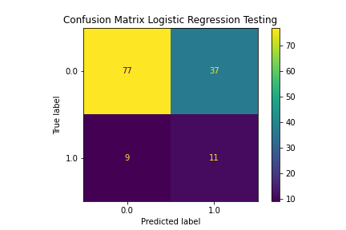
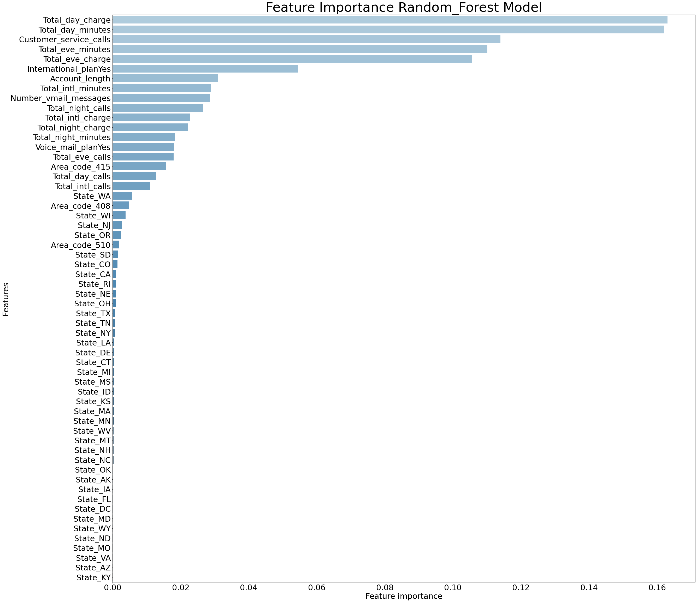
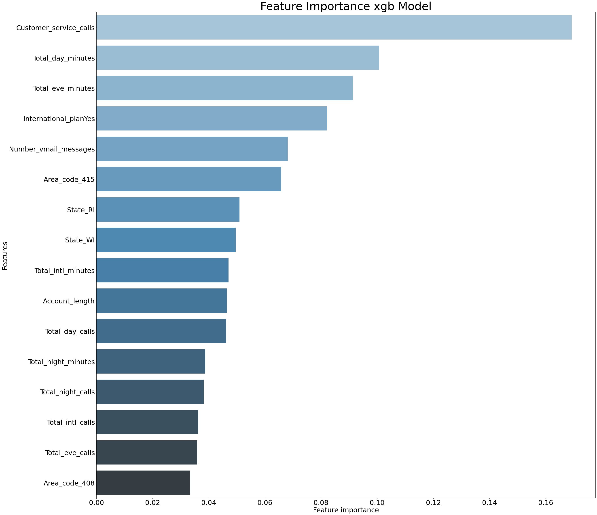

# Overview
This project looks at customer churn rate at a telecom company and analyzed it's causes. After building several models, XGBoost ended up giving the best results. 

We also noted some causes that seem to lead to Churn; the prominent reason seemed to be __high total bill__, and the number of __customer service calls__. 

## Recommended Action
We would recommend offering a discount to customers suspected of Churning and analyze the effect over the following months.

## Models
- Dataset is imbalanced so resampling is used
- Recall is used as our metric for how well a model performs since we want to capture as many customers as possible before they leave. We also consider F1 score, to balence overall performance
- __Best performing model was XGBoost__

### Logistic Regression

Summary 
- Best Prediction (Testing Set)
    - __Recall = 0.500000__
    - __F1 = 0.294118__
    - Accuracy = 0.641791
    - Precision = 0.208333

- Confusion Matrix

### Random Forest

Summary 
- Best Prediction (Testing Set)
    - __Recall = 0.650000__
    - __F1 = 0.530612__
    - Accuracy = 0.828358
    - Precision = 0.448276

- Confusion Matrix

- Feature Importance

### XGBoost

Summary 
- Best Prediction (Testing Set)
    - __Recall = 0.850000__
    - __F1 = 0.629630__
    - Accuracy = 0.850746
    - Precision = 0.500000

- Confusion Matrix

- Feature Importance

## General EDA and Initial Insights
- Graphing catagorical features with respect to Churn(1 = Churned customer)

### Pairplots of continous Variables against churn
- the main take away from this messy graph is just that it seems Churn is somewhat correlated with higher minutes calls, and therefore charge

